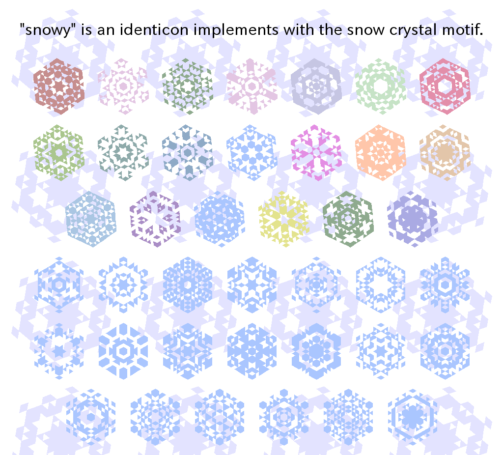

# snowy

"snowy" is an identicon implements with the snow crystal motif.

  * package name: snowy
  * version: 0.1
  * software quality: EXPERIMENTAL
  * license: BSD-2-clause License
  * author: dearblue <dearblue@users.noreply.github.com>
  * report issue to: <https://github.com/dearblue/ruby-snowy/issues/>
  * dependency ruby: ruby-2.1+
  * dependency ruby gems: (none)
  * dependency library: (none)
  * bundled external C library: (none)




## How to usage

``` ruby:ruby
require "snowy"
require "zlib"

str = "abcdefg"
salt = 0
id = Zlib.crc32(str, salt) # transcode to 32-bits integer
pngdata = Snowy.generate_to_png(id, size: 256)
File.binwrite("snowy.png", pngdata)
```


## Demonstration with web browser

``` shell
$ ruby snowy-demo.rb -p 4567
```

And, access to http://localhost:4567/ on web browser.
